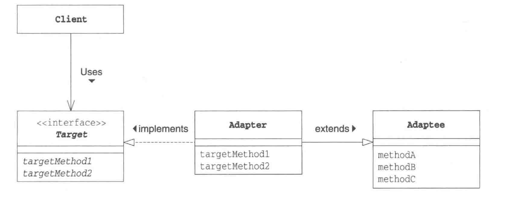
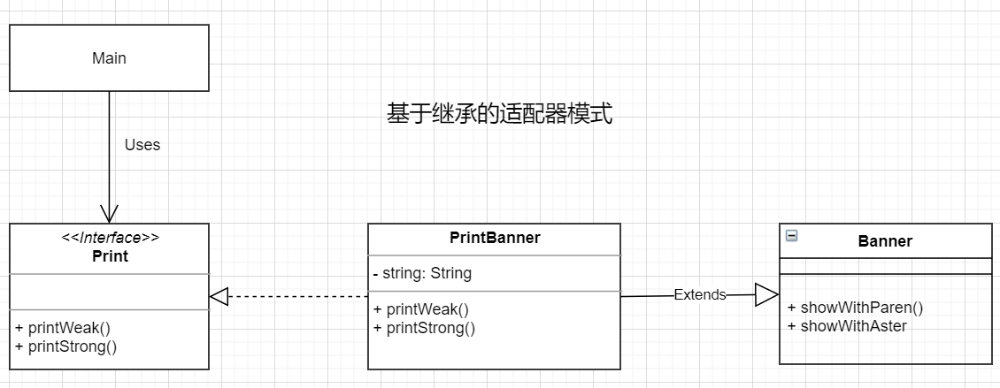
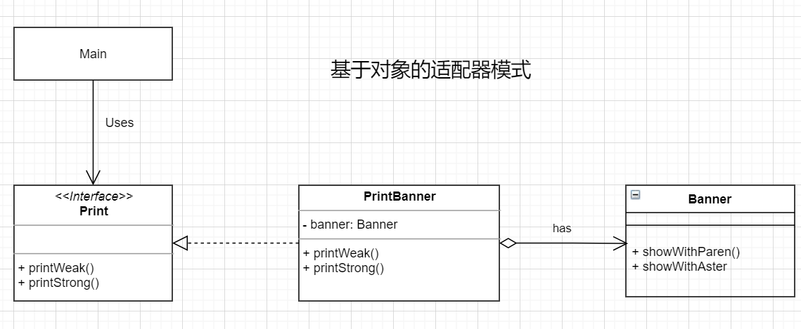

# 适配器（Adapter）模式

**类适配器**



实例：基于继承的类适配器（Python）

```python
# 基于继承的适配器

# Target 需求方
class Print(object):
    # 弱电压
    def printWeak(self) -> None:
        pass

    # 强电压
    def printStrong(self) -> None:
        pass

# Adaptee 被适配者
class Banner(object):

    def __init__(self, string: str) -> None:
        self._string: str = string

    def showWithParen(self) -> None:
        print("(" + self._string + ")")

    def showWithAster(self) -> None:
        print("*" + self._string + "*")

# Adapter
class PrintBanner(Banner, Print):

    def __init__(self, string: str) -> None:
        Banner.__init__(self, string)  # 注意

    def printWeak(self) -> None:
        self.showWithParen()

    def printStrong(self) -> None:
        self.showWithAster()

if __name__ == "__main__":
    p: Print = PrintBanner("Hello")
    p.printWeak()
    p.printStrong()
```



---


实例：基于委托的对象适配器（Python）

```python
# 基于对象(委托)的适配器

# Target 需求方
class Print(object):
    # 弱电压
    def printWeak(self) -> None:
        pass

    # 强电压
    def printStrong(self) -> None:
        pass

# Adaptee 被适配者
class Banner(object):

    def __init__(self, string: str) -> None:
        self._string: str = string

    def showWithParen(self) -> None:
        print("(" + self._string + ")")

    def showWithAster(self) -> None:
        print("*" + self._string + "*")

# Adapter
class PrintBanner(Print):

    def __init__(self, string: str) -> None:
        self._banner: Banner = Banner(string)

    def printWeak(self) -> None:
        self._banner.showWithParen()

    def printStrong(self) -> None:
        self._banner.showWithAster()

if __name__ == "__main__":
    p: Print = PrintBanner("Hello")
    p.printWeak()
    p.printStrong()
```

