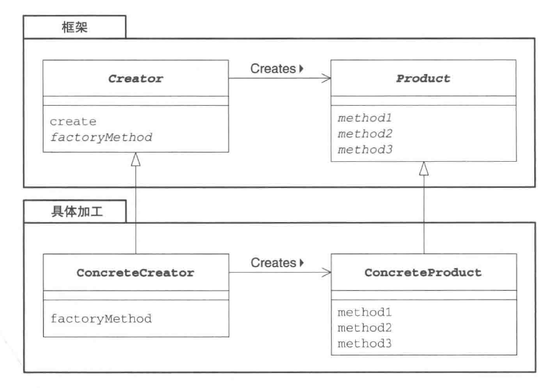
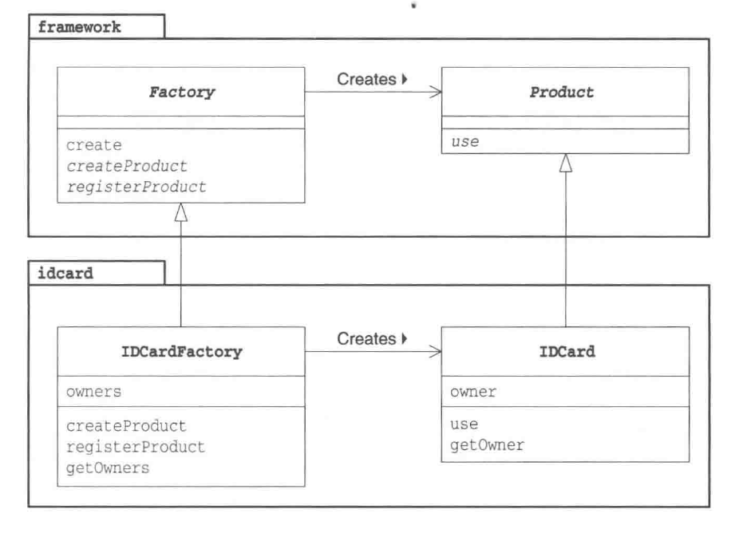

# 工厂方法模式



```python
from typing import List

# Product
class Product(object):
    def use(self) -> None:
        pass

# Creator
class Factory(object):
    # 通过类(工厂)方法获取实例
    def create(self, owner: str) -> Product:
        p: Product = self.createProduct(owner)
        self._registerProduct(p)
        return p

    # 根据不同工厂加工的产品返回相应的实例
    def createProduct(self, owner: str) -> Product:
        pass

    def _registerProduct(self, product: Product) -> None:
        pass

# Concrete Product
class IDCard(Product):
    def __init__(self, owner: str) -> None:
        print("制作" + owner + "的 ID 卡")
        self._owner: str = owner

    def use(self) -> None:
        print("使用" + self._owner + "的 ID 卡")

    def getOwner(self) -> str:
        return self._owner

# Concrete Creator
class IDCardFactory(Factory):
    def __init__(self) -> None:
        self._owners: List[str] = []

    def createProduct(self, owner: str) -> Product:
        return IDCard(owner)

    def _registerProduct(self, product: IDCard) -> None:
        self._owners.append(product.getOwner())

    def getOwners(self) -> List:
        return self._owners

def main() -> None:
    factory: Factory = IDCardFactory()
    card1: Product = factory.createProduct("小叶")
    card2: Product = factory.createProduct("小白")
    card3: Product = factory.createProduct("小菜")

    card1.use()
    card2.use()
    card3.use()

if __name__ == '__main__':
    main()
```

