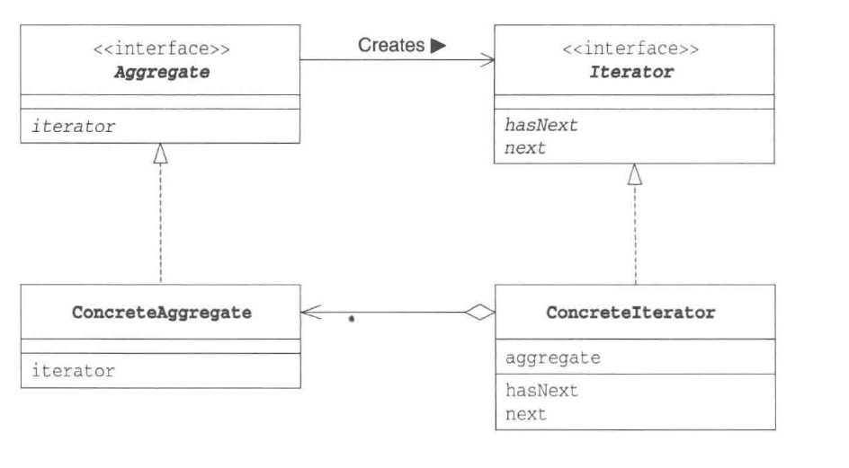
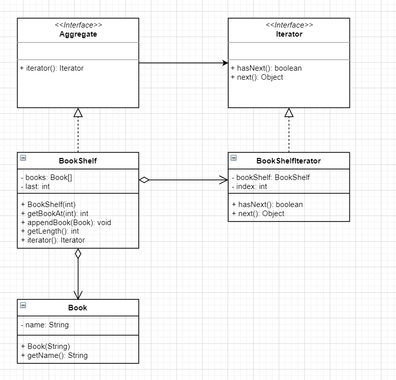

# 迭代器模式



```python
# mypy mypy_check_type.py
from typing import List, Iterable


# 抽象迭代器类
class Iterator(object):
    def hasNext(self):
        pass

    def next(self):
        pass

# 抽象聚集类
class Aggregate(object):
    def iterator(self):
        pass

class BookShelf(Aggregate):
    def __init__(self) -> None:
        self._books: List[Book] = []
        self._last: int = 0

    def getBookAt(self, index: int) -> Book:
        return self._books[index]

    def appendBook(self, book: Book) -> None:
        self._books.append(book)
        self._last = self._last + 1

    def getLength(self) -> int:
        return self._last

    def iterator(self) -> BookShelfIterator:
        return BookShelfIterator(self)

class BookShelfIterator(Iterator):
    def __init__(self, bookShelf) -> None:
        self._bookShelf: BookShelf = bookShelf
        self._index: int = 0

    def hasNext(self) -> bool:
        if self._index < self._bookShelf.getLength():
            return True
        else:
            return False

    def next(self) -> Book:
        book: Book = self._bookShelf.getBookAt(self._index)
        self._index = self._index + 1
        return book

class Book():
    def __init__(self, name) -> None:
        self._name: str = name

    def getName(self) -> str:
        return self._name

if __name__ == "__main__":
    bookShelf: BookShelf = BookShelf()
    bookShelf.appendBook(Book("A"))
    bookShelf.appendBook(Book("B"))
    bookShelf.appendBook(Book("C"))
    bookShelf.appendBook(Book("D"))

    it: Iterator = bookShelf.iterator()
    while it.hasNext():
        book: Book = it.next()
        print(book.getName())
```

