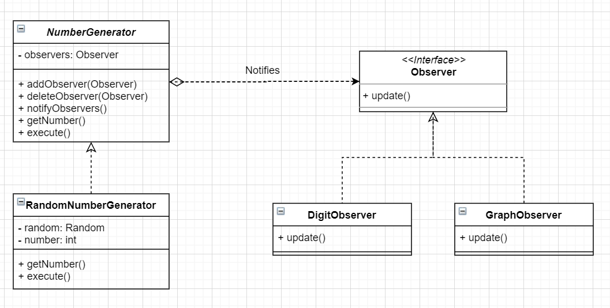

# 观察者模式


```python
import random
from typing import List, Optional

# 发布者(Publisher)接口
class NumberGenerator(object):
    def __init__(self) -> None:
        self._observers: List[Observer] = []

    def addObserver(self, observer) -> None:
        self._observers.append(observer)

    # observer: Observer 做类型注释有 Bug，Mypy 的问题？GC？
    # NameError: name 'Observer' is not defined
    def deleteObserver(self, observer) -> None:
        self._observers.remove(observer)

    def notifyObservers(self) -> None:
        for o in self._observers:
            o.update(self)  # 注意这里

    # 接口方法
    def getNumber(self) -> Optional[int]:  # 获取数值
        pass

    def execute(self) -> Optional[int]:    # 生成数值
        pass

# 订阅者(Subscriber)接口
class Observer(object):
    def update(self, generator: NumberGenerator) -> None:
        return None

# Congreate Publisher
class RandomNumberGenerator(NumberGenerator):
    def __init__(self) -> None:
        super().__init__()
        self._number: Optional[int]

    def getNumber(self) -> Optional[int]:
        return self._number

    def execute(self) -> None:
        for _ in range(20):
            self._number = random.randint(0, 50)
            self.notifyObservers()

# Congreate Subscriber
class DigitObserver(Observer):
    def update(self, generator: NumberGenerator) -> None:
        print("DigitObserver: " + str(generator.getNumber()))

# Congreate Subscriber
class GraphObserver(Observer):
    def update(self, generator: NumberGenerator) -> None:
        count: Optional[int] = generator.getNumber()
        print("GraphObserver: ", end='')
        while count:
            print("*", end='')
            count = count - 1
        print()

def client() -> None:
    generator: NumberGenerator = RandomNumberGenerator()

    observer1: Observer = DigitObserver()
    observer2: Observer = GraphObserver()

    generator.addObserver(observer1)
    generator.addObserver(observer2)

    generator.execute()

if __name__ == '__main__':
    client()
```

