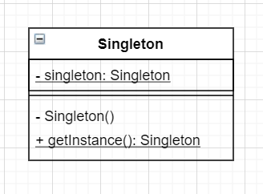

# 单例模式



```java
//Main.java
public class Main {
    public static void main(String[] args) {
        System.out.println("开始");
        Singleton obj1 = Singleton.getInstance();
        Singleton obj2 = Singleton.getInstance();
        if(obj1 == obj2) {
            System.out.println("obj1 与 obj2 为同一个实例");
        } else {
            System.out.println("obj1 与 obj2 不是同一个实例");
        }
        System.out.println("结束");
    }
}
//javac -encoding UTF-8 Main.java

//Singleton.java
public class Singleton {
    private static Singleton singleton = new Singleton();
    //私有的构造方法
    private Singleton() {
        System.out.println("生成了一个实例！");
    }
    public static Singleton getInstance() {
        return singleton;
    }
}
```